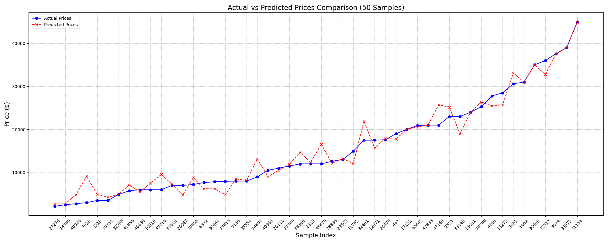

# What Drives the Price of a Car?

## Overview

The purpose of this project is to analyze and understand the factors that influence the price of a car. To accomplish this task, various machine learning models will be used along with a standardized process for data preprocessing and analysis called CRISP-DM.

## Dataset

The dataset used in this project is based on the [Used Cars Dataset](https://www.kaggle.com/datasets/austinreese/craigslist-carstrucks-data) from Kaggle. The dataset contains the following features:

- `ID`: A unique identifier for each data point.
- `Region`: The region the car is located in.
- `Price`: The price of the car in USD. This is the target variable that we will predict.
- `Year`: The year the car was built.
- `Manufacturer`: The manufacturer of the car.
- `Model`: The model of the car.
- `Condition`: The condition of the car.
- `Cylinders`: The number of cylinders in the engine.
- `Fuel`: The type of fuel the car uses.
- `Odometer`: The number of miles the car has driven.
- `Title Status`: The status of the car's title.
- `Transmission`: The type of transmission the car uses.
- `VIN`: The Vehicle Identification Number (VIN) of the car.
- `Drive`: The type of drivetrain the car uses.
- `Size`: The size of the car.
- `Type`: The type of the car.
- `Paint Color`: The color of the car.
- `State`: The state the car is located in.

The target variable is `Price`.

There are a total of 18 features (including the target) and 426,880 data points.

## Methods

The CRISP-DM process is a standardized framework for data mining that includes the following steps:

- Business Understanding
- Data Understanding
- Data Preparation
- Modeling
- Evaluation
- Deployment

### Business Understanding

The business objective of this project is to develop a predictive model that can accurately estimate the price of a used car based on its various features. This information will be provided to a car dealership to help them gain a better understanding of how and why certain factors increase or decrease the price of a used car so that they can make more informed and data-driven decisions and maximize their profits.

### Data Understanding

#### Exploratory Data Analysis

The dataset was examined in an effort to better understand its structure and characteristics. This consisted of the following steps:

- Generating descriptive statistics and understanding the statistical properties of the dataset.
- Understanding the features and their unique values.
- Cleaning and standardizing the features and values (renaming columns as needed to allow for better presentation and to aid in manipulating the data, ensuring all categorical values made sense, etc).

#### Data Quality Assessment

The quality of the dataset was analyzed by:

- Checking for missing values.
- Checking for duplicate data points.

#### Data Visualization

To better understand the relationships between the features and the target variable, various visualizations were created, including:

- Box plots for numerical features including the target (price) to visually inspect for outliers and the distribution of each feature.
- KDE plots of numerical features including the target (price) to further identify outliers and the distribution of each feature.
- Scatter plots to better understand correlations between various features.
- Count plots to understand the distributions of categorical features.

### Data Preparation

Various steps were taken to preprocess the dataset and better prepare it for modeling:

- Features that were not of importance for building the models were dropped.
- There was a substantial amount of missing data, so this was dealt with in various ways. In some cases, rows in features that were missing 5% or less of their data points were removed. In other cases, rows that contained values in a minimal number of relatively unimportant features were removed. And in cases where the proportion of missing data was too substantial to remove these rows entirely, an imputation was used that attempted to predict these values using information from rows that had complete data and matched the model and manufacturer of the row with missing data.
- Cutoffs for outliers were determined and these outliers were removed.
- New visualization were created to see the effects of this data preprocessing and gain an updated understanding of interactions between various features.
- Categorical features were label encoded and numerical features were scaled using the `StandardScaler` from `sklearn.preprocessing` in order to normalize their values.
- Finally, the dataset was split into a training set comprised of 80% of the available data points and a testing set comprised of the remaining 20%.

### Modeling

Various models were built to see which had the best performance in predicting the price of used cars. The models explored included:

- Linear Regression
- Lasso Regression
- Ridge Regression
- Random Forest Regression

All models were scores using the R-squared metric, accuracy, mean squared error, root MSE, and mean absolute error on the test set. The random forest model was found to have the best overall performance, with an R-squared score of 0.9216 on the test set. This model was then optimized using hyperparameter tuning using hyperparameter grid search (`GridSearchCV`) to further improve its predictive capabilities. The optimized model's R-squared score was slightly improved, scoring 0.9236 on the test set with an accuracy of 92.36%.

### Evaluation

The following steps were taken to evaluate the results from modeling:

- Model scores were summarized in a table.
- Scores were visualized using bar plots and line plots to gain a clearer comparative understanding of the models' performance.
- The best model was used to predict prices on 50 sample points from the test set and the results were visualized.
- The best model's features importances were calculated and summarized in a table and visualized using a bar plot.

## Findings

- The various model performances are summarized in the following table:

| Model                     | R^2 Score | Accuracy (%) | Mean Squared Error | Root MSE  | Mean Absolute Error |
| ------------------------- | --------- | ------------ | ------------------ | --------- | ------------------- |
| Linear Regression         | 0.5837    | 58.3659      | 7.134290e+07       | 8446.4727 | 5994.8095           |
| Lasso Regression          | 0.5837    | 58.3658      | 7.134302e+07       | 8446.4796 | 5994.8007           |
| Ridge Regression          | 0.5837    | 58.3658      | 7.134301e+07       | 8446.4791 | 5994.8083           |
| Random Forest (Base)      | 0.9216    | 92.1583      | 1.343721e+07       | 3665.6804 | 1988.1377           |
| Random Forest (Optimized) | 0.9236    | 92.3588      | 1.309380e+07       | 3618.5350 | 1957.0711           |

- The random forest model significantly outperformed the other models, with an R-squared score of 0.9216 on the test set. The optimized random forest model had a slightly improved R-squared score of 0.9236. All other models had the exact same R-squared score of 0.5837 and accuracy of 58.37%, indicating that they were not very effective at predicting the price of used cars in this dataset.
- The real-world performance of the optimized random forest model can be seen in the following visualization, which shows the predicted prices of 50 sample points from the test set against the actual prices. For most of the range, the predicted prices follow the trend of the actual prices relatively closely, although there are some discrepancies. Towards the end of the sample range, there is a sharp increase in actual prices, which the model also predicts, albeit with some variance.

- The `Price`, `Year`, and `Odometer` features had large discrepancies between their minimum/maximum and 25th/75th percentile values, indicating the presences of outliers. These outliers were removed in the data preparation stage.
- There was a moderately strong correlation between `Price` and `Year`, and a stronger negative correlation between `Price` and `Odometer`. This suggests that the `Year` and `Odometer` features are important predictors of the target variable `Price` (newer cars and cars with less miles tend to be more expensive).
- Cars in the `Fair` or `Salvage` condition were significantly less expensive than cars in any other condition, which did not show a marked difference in average price. `New` cars, however, had the greatest range of prices.
- The feature importances table shows how impactful each feature was on predicting the car price when using the optimized random forest model:

|   Feature    | Importance (%) |
| :----------: | :------------: |
|     Year     |     38.85      |
|  Cylinders   |     19.58      |
|   Odometer   |     13.92      |
|     Fuel     |      8.13      |
|    Model     |      5.51      |
| Manufacturer |      3.40      |
|    Drive     |      3.02      |
|     Type     |      1.89      |
|    State     |      1.37      |
|    Region    |      1.23      |
|  Condition   |      0.99      |
|  PaintColor  |      0.87      |
| TitleStatus  |      0.65      |
| Transmission |      0.60      |

- The `Year` feature was the most important predictor of car price, followed by `Cylinders` and `Odometer`. The `Fuel` and `Model` features were also relatively important, while the `Transmission` feature was the least important.

## Recommendations to Dealers

Based on the findings of this project, the following recommendations can be made to car dealerships:

- Focus on newer cars with fewer miles, as these tend to be more expensive.
- Ford and Chevrolet are the most popular manufacturers - the Ford F-150 in particular is extremely popular and thus a solid choice for dealerships to stock.
- The prices of used cars drop precipitously after about 60,000 miles, fetching nearly double the price of cars with greater than about 90,000 miles.
- There is considerable leeway in pricing for new cars, suggesting more profit can be made if smart pricing strategies are used. For other conditions besides `Fair` and `Salvage`, there is not a significant difference in average price. As shown by the feature importances, the condition of a car plays a relatively minor role in predicting the price, so it is probably not worthwhile to spend much time focusing on a car's condition unless it is already in bad shape.
- The number of cylinders a car has is, somewhat surprisingly, a very important predictor of price, so dealerships would be served well by focusing on finding cars with more cylinders in good shape at prices where profits can be made. Upon examination this does make sense, as cars with more cylinders tend to be more powerful and more complex and thus more expensive.
- If a dealership has access to its own car pricing data, using a random forest model to help predict prices and determine pricing strategies can be an extremely effective way to maximize profits. The model can achieve a relatively high prediction accuracy without requiring a lot of computational power or time to train.